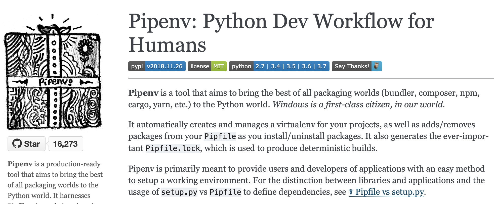

theme: Huerta


# A Potted History of Python Packaging
### (Or how we got to Pipenv)
## PyCon Limerick
## March 2019
### Michael Twomey
### @micktwomey


---



---

# Timeline: Python Packaging

(In the wrong order and omitting bits to suit my narrative.)

---

# Problems We Need to Solve in 1995

* We need to distribute python libraries
* We need to find and install libraries (we have newsgroups!)
* We need to specify dependencies for a project (we don't know we need to do this yet)
* We clobber packages in the system (we don't know this is a bad thing yet)
* We need to use the latest and greatest versions of dependencies (sensibly)
* We need to stay sane

---

# cp -r

```sh
cp somemodule.py myapp
cd myapp
python main.py
```

* Simple, works for most cases
* Pretty close to how I've built apps to ship to someone's desktop
* Advanced: cp -r
* Super advanced: python path .pth files

---

# distutils

> In the beginning there was setup.py

```python
from distutils.core import setup
setup(name="my_package", version="1.0", ...)
```

```sh
$ unzip my_package-1.0.zip
$ cd my_package-1.0
$ python setup.py install
```

* For packaging libraries, not so good for apps
* No dependency management
* Installs into python's `site-packages`

---

# Lots of Attempts to Improve

* easy_install, eggs, setuptools, wheels, many more
* Iterations and refinements on the contents of libraries
* Gave us the notion of dependencies and library versions (e.g. `django <= 2.0.1`)
* eggs created to act like java jars for python. Latest iteration of idea are wheels. (AFAIK it's snake eggs and cheese wheels)
* Didn't solve lots of projects with different versions of same libraries

---

# pip

Built on setuptools work to give us way to download and install packages

```sh
$ pip install 'django<2.0'
Collecting django<2.0
  Downloading https://files.pythonhosted.org/packages/44/e7/872bbf76aa16b7a061698d75325dac023285db33db4bda8ba8fe5d3bb356/Django-1.11.16-py2.py3-none-any.whl (7.0MB)
    100% |████████████████████████████████| 7.0MB 3.3MB/s
Collecting pytz (from django<2.0)
  Downloading https://files.pythonhosted.org/packages/f8/0e/2365ddc010afb3d79147f1dd544e5ee24bf4ece58ab99b16fbb465ce6dc0/pytz-2018.7-py2.py3-none-any.whl (506kB)
    100% |████████████████████████████████| 512kB 10.3MB/s
Installing collected packages: pytz, django
Successfully installed django-1.11.16 pytz-2018.7
```

---

# pip bonus: uninstall

(easy_install did this too.)

```
$ pip uninstall django pytz
Uninstalling Django-1.11.16:
  Would remove:
    /usr/bin/django-admin
    /usr/bin/django-admin.py
    /usr/lib/python3.7/site-packages/Django-1.11.16.dist-info/*
    /usr/lib/python3.7/site-packages/django/*
Proceed (y/n)? y
  Successfully uninstalled Django-1.11.16
Uninstalling pytz-2018.7:
  Would remove:
    /usr/lib/python3.7/site-packages/pytz-2018.7.dist-info/*
    /usr/lib/python3.7/site-packages/pytz/*
Proceed (y/n)? y
  Successfully uninstalled pytz-2018.7
```

---

# pip requirements.txt

Gave us way to specify dependencies in a project (woo!)

```
Django==1.11.16
pytz==2018.7
```

```
$ pip install -r requirements.txt
Collecting Django==1.11.16 (from -r /tmp/requirements.txt (line 1))
  Using cached https://files.pythonhosted.org/packages/44/e7/872bbf76aa16b7a061698d75325dac023285db33db4bda8ba8fe5d3bb356/Django-1.11.16-py2.py3-none-any.whl
Collecting pytz==2018.7 (from -r /tmp/requirements.txt (line 2))
  Using cached https://files.pythonhosted.org/packages/f8/0e/2365ddc010afb3d79147f1dd544e5ee24bf4ece58ab99b16fbb465ce6dc0/pytz-2018.7-py2.py3-none-any.whl
Installing collected packages: pytz, Django
Successfully installed Django-1.11.16 pytz-2018.7
```

---

# So far

* We've solved distributing python libraries
* We've solved finding and installing libraries
* We've solved specifying dependencies for a project
* We're still clobbering packages in the system
    - Workaround: build a separate python per project (boo)

---

# virtualenv

Exploited a neat trick: python looks for its libraries relative to the python binary. Could create symlinks from a copy of python back to system, creating an independent python install

```
$ python -m venv /tmp/myenv
$ find /tmp/myenv
/tmp/myenv/bin/python3.7
/tmp/myenv/bin/activate
...
/tmp/myenv/lib/python3.7/site-packages/
$ . /tmp/myenv/bin/activate
$ which python
/tmp/myenv/bin/python
$ pip list
pip        10.0.1
setuptools 39.0.1
```

---

# So far

* We've solved distributing python libraries
* We've solved finding and installing libraries
* We've solved specifying dependencies for a project
* We've solved clobbering system python

---

# Done? 
# Python development is perfect?

---

# Kinda

* `requirements.txt` a little fiddly to manage
    * `django==2.0.1` is better than `django>1.0` or even `django`
    * How do we update? e.g. `pip-tools` partially solves
* Each project has to figure out how to manage virtualenvs
    - Some impose patterns which are hard for some people to work with
* Security is opt in

---

# pipenv (finally!)

* Computer science solution: Add another layer of abstraction
* Handles pip and virtualenv for you
* Handles both high level dependencies (`Pipfile`) and specific versions (`Pipfile.lock`)
* More secure by default
* Nice little snake emoji
* And more!

---

```
$ pipenv install Flask
Creating a Pipfile for this project…
Installing Flask…
Adding Flask to Pipfile's [packages]…
✔ Installation Succeeded
Pipfile.lock not found, creating…
Locking [dev-packages] dependencies…
Locking [packages] dependencies…
✔ Success!
Updated Pipfile.lock (662286)!
Installing dependencies from Pipfile.lock (662286)…
  🐍   ▉▉▉▉▉▉▉▉▉▉▉▉▉▉▉▉▉▉▉▉▉▉▉▉▉▉▉▉▉▉▉▉ 6/6 — 00:00:01
```

---

# Pipfile

```ini
[[source]]
name = "pypi"
url = "https://pypi.org/simple"
verify_ssl = true

[dev-packages]

[packages]
flask = "*"

[requires]
python_version = "3.7"
```

---

# Pipfile.lock

```js
{
    "_meta": {
        "hash": {
            "sha256": "a82b674d67d29678775ff6b773de1686a9593749ec14483b0d8e05131b662286"
        },
        "pipfile-spec": 6,
        "requires": {
            "python_version": "3.7"
        },
        "sources": [
            {
                "name": "pypi",
                "url": "https://pypi.org/simple",
                "verify_ssl": true
            }
        ]
    },
    "default": {
        "click": {
            "hashes": [
                "sha256:2335065e6395b9e67ca716de5f7526736bfa6ceead690adf616d925bdc622b13",
            ],
            "version": "==7.0"
        },
        "flask": { ... },
        ...
    },
    "develop": {}
}

```

---

# Bonus: Security Checks

```
$ pipenv check
Checking PEP 508 requirements…
Passed!
Checking installed package safety…
All good!
```

---

# Bonus: .env

```
$ cat .env
DB_SECRET_PASSWORD=sekret

$ pipenv shell --fancy
Loading .env environment variables…
Creating a virtualenv for this project…
Pipfile: /Users/michael/Dropbox/2018/Presentations/2018-11_PyLadies_Dublin_pipenv/demos/flask/Pipfile
Using /usr/local/bin/python3 (3.7.1) to create virtualenv…
✔ Complete
Using base prefix '/usr/local/Cellar/python/3.7.1/Frameworks/Python.framework/Versions/3.7'
New python executable in /Users/michael/.local/share/virtualenvs/flask-xL7FF9jX/bin/python3.7
Also creating executable in /Users/michael/.local/share/virtualenvs/flask-xL7FF9jX/bin/python
Installing setuptools, pip, wheel...
done.
Running virtualenv with interpreter /usr/local/bin/python3
Virtualenv location: /Users/michael/.local/share/virtualenvs/flask-xL7FF9jX
Launching subshell in virtual environment…

$ env | grep SECRET
DB_SECRET_PASSWORD=sekret
```

---

# Bonus: pyenv

Free yourself from the tyranny of system python installs! (Not pipenv related but works well with pipenv.)

```
$ echo $PYENV_ROOT
/Users/michael/.pyenv
 
$ ls $PYENV_ROOT/versions/
2.7.15         3.6.6          3.7.0          3.7.1

$ pipenv install --python 3.6 flask
Creating a virtualenv for this project…
Pipfile: /private/tmp/old/Pipfile
Using /Users/michael/.pyenv/versions/3.6.6/bin/python3 (3.6.6) to create virtualenv…
✔ Complete
...
Updated Pipfile.lock (8a3288)!
Installing dependencies from Pipfile.lock (8a3288)…
  🐍   ▉▉▉▉▉▉▉▉▉▉▉▉▉▉▉▉▉▉▉▉▉▉▉▉▉▉▉▉▉▉▉▉ 6/6 — 00:00:01
To activate this project's virtualenv, run pipenv shell.
Alternatively, run a command inside the virtualenv with pipenv run.
```

---

# Bonus: Native Visual Studio Code Support

Autodetects Pipfile and loads correct virtualenv


---

# Bonus: Stores Virtualenvs Outside of Source

* Keeps your source directory small
* Keep your source in Dropbox but don't pay for your libs :)

```
$ ls -a
.env             Pipfile          Pipfile.lock     flask_example.py

$ du -shc .
 16K    .
 16K    total

$ du -shc (pipenv --venv)
 11M    /Users/michael/.local/share/virtualenvs/flask-xL7FF9jX
 11M    total
```

---

Links

* This Talk - `https://github.com/micktwomey/2019-03_PyCon_Limerick_pipenv`
* pipenv - `https://pipenv.readthedocs.io/en/latest/`
* python packaging guide - `https://packaging.python.org/`
* pyenv - `https://github.com/pyenv/pyenv`
* Hitchiker's Guide to Python - `https://docs.python-guide.org/`
